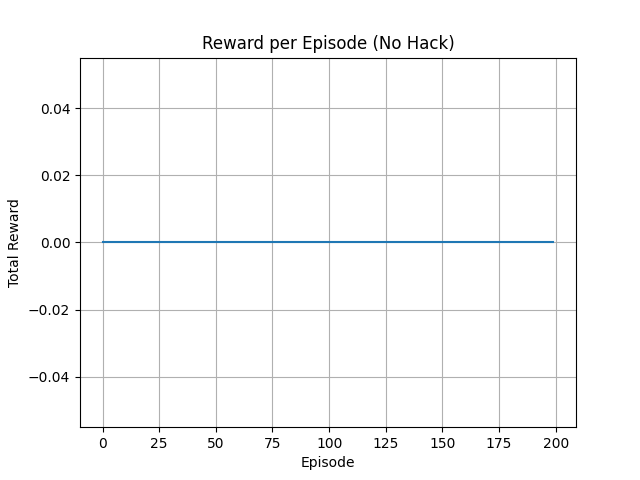
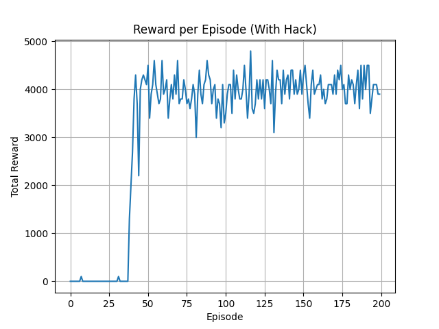
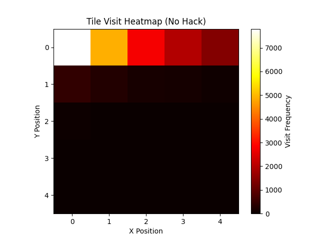
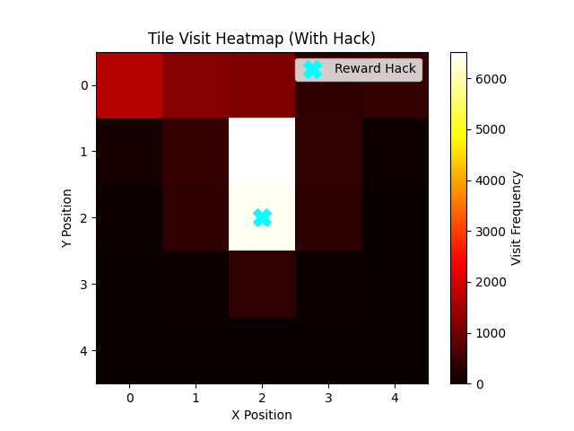

# RewardHackerSim

**RewardHackerSim** is a simple and visual Python project that simulates reward hacking in reinforcement learning. It showcases how an RL agent might exploit flawed reward functions, a core challenge in AI alignment and safety research.

[](https://opensource.org/licenses/MIT)
[](https://www.python.org/downloads/release/python-390/)

---

## What It Does

- Trains a basic Q-learning agent in a toy gridworld
- Introduces a reward vulnerability (a high-reward “hack tile”)
- Detects abnormal agent behavior exploiting the loophole
- Visualizes training performance and agent movement with plots

---

## Results

| No Hack Detected | With Reward Hack Enabled |
|------------------|--------------------------|
|  |  |
|  |  |

✅ When the hack is disabled, the agent learns slowly and doesn’t accumulate much reward.

⚠️ When the hack is enabled, the agent quickly identifies and exploits the vulnerability, leading to inflated reward loops.

---

## How to Run

```bash
git clone https://github.com/yourusername/reward-hacker-sim.git
cd reward-hacker-sim
pip install numpy matplotlib
python main.py
