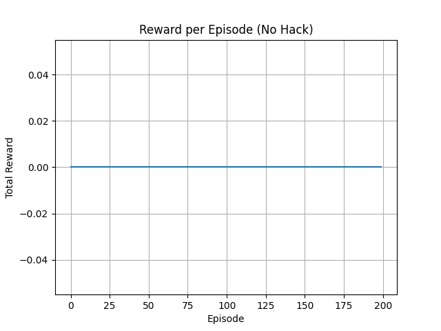
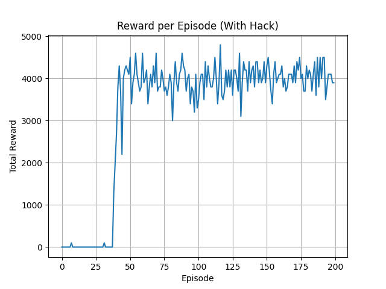
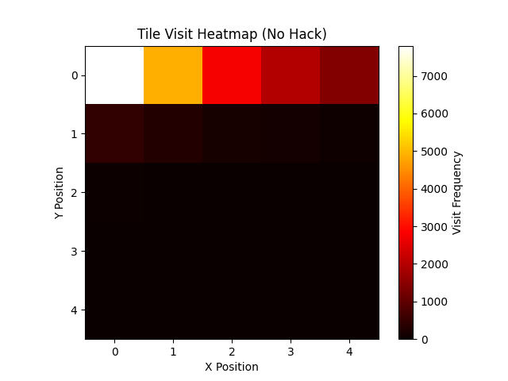
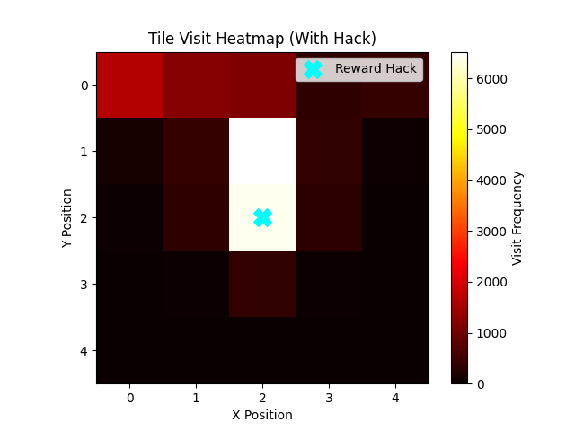

# RewardHackerSim

**RewardHackerSim** is a simple and visual Python project that simulates reward hacking in reinforcement learning. It showcases how an RL agent might exploit flawed reward functions, a core challenge in AI alignment and safety research.

## What It Does

- Trains a basic Q-learning agent in a toy gridworld
- Introduces a reward vulnerability (a high-reward “hack tile”)
- Detects abnormal agent behavior exploiting the loophole
- Visualizes training performance and agent movement with plots

---

## Results

| No Hack Detected | With Reward Hack Enabled |
|------------------|--------------------------|
|  |  |
|  |  |

When the hack is disabled, the agent learns slowly and doesn’t accumulate much reward.
When the hack is enabled, the agent quickly identifies and exploits the vulnerability, leading to inflated reward loops.
